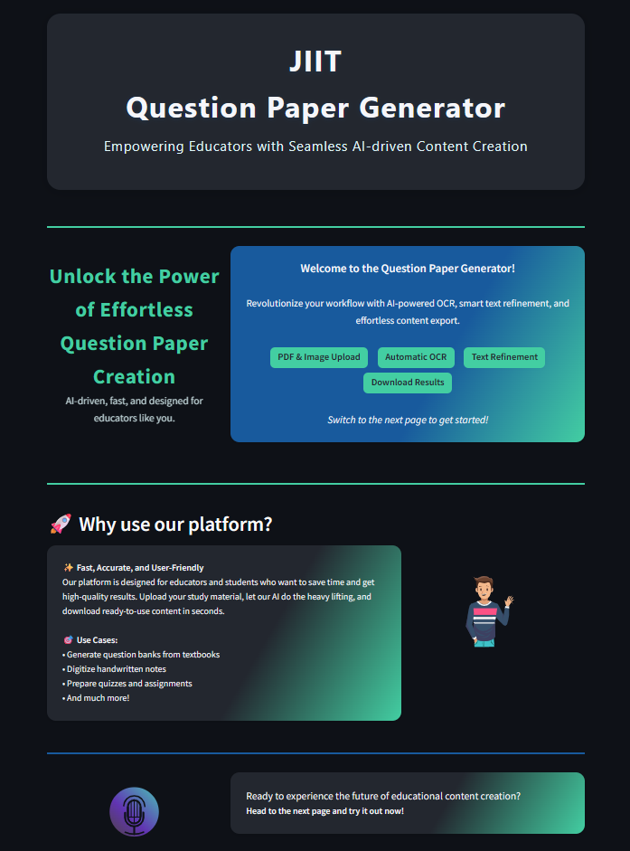
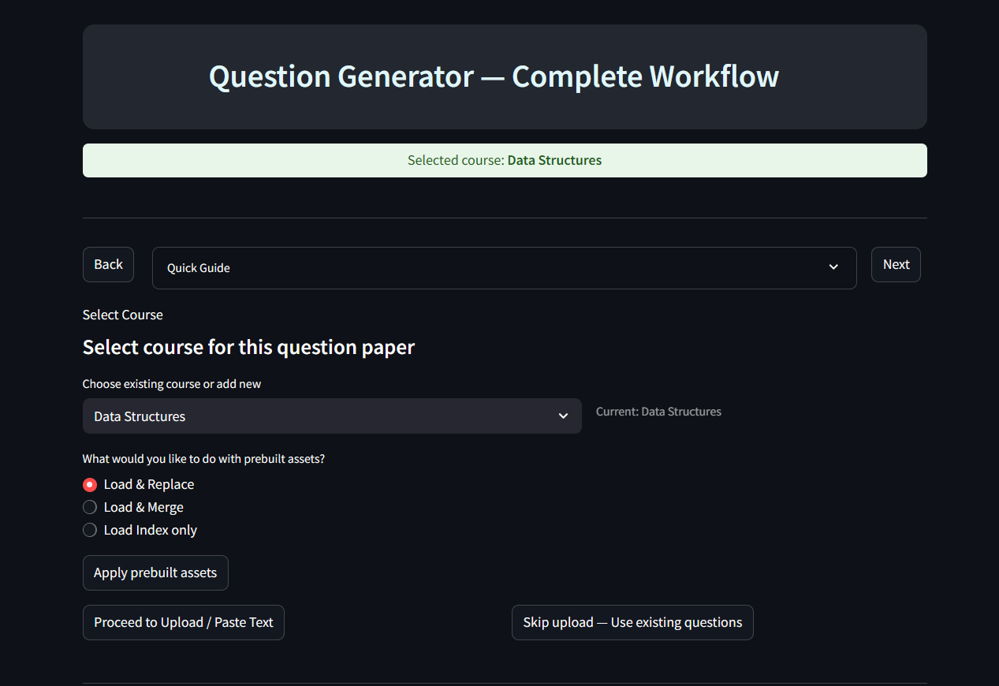
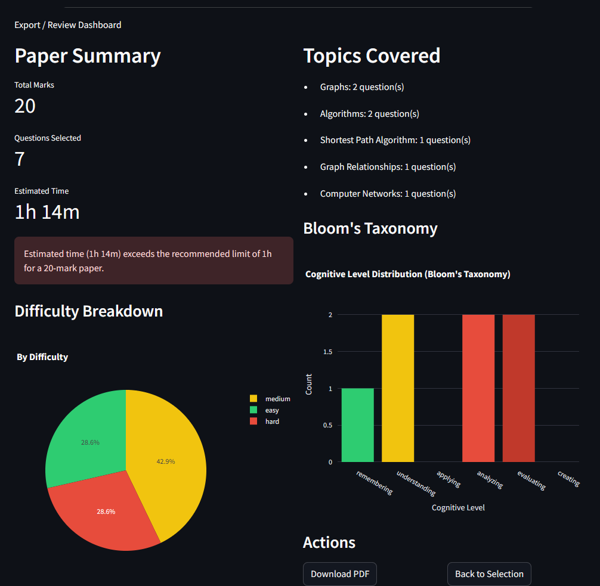

# JIIT Question Paper Generator 🎓

[](https://www.python.org/)
[](https://streamlit.io/)


> An AI-powered platform to automate question paper generation for educators. Extract text from PDFs/images using OCR, generate contextual questions with AI, organize them by courses and difficulty levels, and create customized question papers in seconds.

---

## 📋 Table of Contents

- [Overview](#overview)
- [Key Features](#key-features)
- [Technology Stack](#technology-stack)
- [Project Structure](#project-structure)
- [Installation](#installation)
- [Usage](#usage)
- [How It Works](#how-it-works)
- [Screenshots](#screenshots)
- [Configuration](#configuration)
- [Contributing](#contributing)
- [License](#license)

---

## 🎯 Overview

The **JIIT Question Paper Generator** is a comprehensive Streamlit-based web application designed to revolutionize how educators create question papers. It combines OCR technology, AI-powered question generation, and intelligent search capabilities to automate the entire workflow—from extracting text from study materials to generating customized exam papers.

**Built for:** Educators, academic institutions, and content creators who need to quickly generate quality question papers.

---

## ✨ Key Features

### 🏠 Home Page (`Home.py`)
- **Modern Landing Page** with animated UI elements
- Clean, gradient-based design with responsive layout
- Quick navigation to OCR and Pipeline features
- Feature highlights and use-case demonstrations

### 🔍 OCR & Text Refinement (`1_OCR.py`)
- **Upload PDFs or Images** (PNG, JPG, JPEG, PDF formats supported)
- **Automatic OCR Extraction** using Tesseract and PyMuPDF
- **Text Refinement Engine** to clean and normalize extracted content
- **Download & Copy** refined text for further processing
- **Real-time Processing** with visual feedback

### 🚀 Complete Pipeline (`2_User_Pipeline.py`)
- **Multi-Course Support** with persistent course management
- **Question Generation** using transformer models (T5-based)
- **Subtopic Classification** with Ollama LLM integration
- **FAISS Vector Search** for semantic question retrieval
- **Smart Filtering** by marks, difficulty, and cognitive level
- **Question Bank Management** with add/remove/edit capabilities
- **PDF Export** for generated question papers
- **Batch Processing** of multiple questions
- **Course Asset Detection** with precomputed indices

---

## 🛠️ Technology Stack

### Core Technologies
- **Streamlit** - Interactive web application framework
- **Python 3.10+** - Primary programming language

### AI/ML Components
- **Transformers (Hugging Face)** - Question generation models
- **Ollama + LangChain** - LLM integration for subtopic prediction
- **FAISS** - Vector database for semantic search
- **Sentence Transformers** - Text embeddings

### OCR & Document Processing
- **Tesseract OCR** - Text extraction from images
- **XaLatex || PyMuPDF (fitz)** - PDF processing and manipulation
- **Pillow (PIL)** - Image processing
- **OpenCV** - Advanced image preprocessing

### Data & Storage
- **Pandas** - Data manipulation
- **JSON** - Structured data storage
- **CSV** - Database exports

---

## 📁 Project Structure

```
(MAIN FILES TO VIEW)
coe-project/
├── Home.py                          # Main landing page (Streamlit entry)
├── pages/
    ├── 1_OCR.py                     # OCR extraction & 
    └── 2_User_Pipeline.py           # Complete question

---

## 🚀 Installation

### Prerequisites
- **Python 3.10 or higher**
- **Tesseract OCR** installed on your system
  - Windows: Download from [GitHub](https://github.com/UB-Mannheim/tesseract/wiki)
  - Linux: `sudo apt-get install tesseract-ocr`
  - macOS: `brew install tesseract`
- **Ollama** (optional, for LLM-based subtopic generation)
  - Install from [ollama.ai](https://ollama.ai/)
  - Pull required model: `ollama pull llama3`
- **MikTex** (For PDF Question Paper Generation)

### Setup Steps

1. **Clone the repository**
   ```bash
   git clone https://github.com/aarush-glitch/QuestionPaperGenerator.git
   cd QuestionPaperGenerator
   ```

2. **Create virtual environment** (recommended)
   ```bash
   python -m venv .venv
   ```

3. **Activate virtual environment**
   - Windows (cmd):
     ```cmd
     .venv\Scripts\activate
     ```
   - Windows (PowerShell):
     ```powershell
     .venv\Scripts\Activate.ps1
     ```
   - Linux/macOS:
     ```bash
     source .venv/bin/activate
     ```

4. **Install dependencies**
   ```bash
   pip install --upgrade pip
   pip install -r requirements.txt
   ```

5. **Configure Tesseract path** (if needed)
   
   Edit the OCR files and set your Tesseract path:
   ```python
   pytesseract.pytesseract.tesseract_cmd = r'C:\Program Files\Tesseract-OCR\tesseract.exe'
   ```

---

## 💻 Usage

### Running the Application

1. **Start the Streamlit app**
   ```bash
   streamlit run Home.py
   ```

2. **Open your browser**
   
   The app will automatically open at `http://localhost:8501`

### Workflow Guide

#### **Step 1: Home Page**
- Welcome page with feature overview
- Navigate to OCR or Pipeline using sidebar

#### **Step 2: OCR Extraction** (`1_OCR.py`)
1. Upload a PDF or image file
2. System automatically extracts and refines text
3. Preview the refined text
4. Download or copy for next steps

#### **Step 3: Question Generation Pipeline** (`2_User_Pipeline.py`)

**Option A: Upload & Generate**
1. Select or create a course
2. Upload study material or paste text
3. Click "Generate Questions"
4. Questions are automatically classified by subtopic

**Option B: Use Existing Question Bank**
1. Select a course with precomputed assets
2. Enter search query (semantic search)
3. Apply filters (marks, difficulty, cognitive level)
4. Add questions to your selection

**Option C: Create Question Paper**
1. Build your selection from generated or searched questions
2. Adjust marks for each question
3. Review total marks and question distribution
4. Export as PDF

---

## 🔄 How It Works

### 1. **OCR & Text Extraction**
- Upload PDFs or images containing study material
- PyMuPDF converts PDF pages to images
- Tesseract OCR extracts raw text
- Refinement engine cleans formatting, removes artifacts

### 2. **Question Generation**
- Text is chunked into meaningful segments
- T5-based transformer model generates questions
- Ollama (LLaMA 3) predicts subtopics for each question
- Questions labeled with:
  - Topic & Subtopic
  - Marks (configurable)
  - Difficulty Level (Easy/Medium/Hard)
  - Cognitive Level (Remember/Understand/Apply/Analyze)
  - Estimated Time

### 3. **Subtopic Cleaning**
- Regex-based cleaning of LLM output
- Standardization into academic terminology
- Removal of hallucinations and noise

### 4. **Vector Embedding & Search**
- Questions embedded using OllamaEmbeddings
- Stored in FAISS vector index for fast retrieval
- Semantic search with metadata filtering
- Smart fallback when exact matches unavailable

### 5. **Question Paper Assembly**
- Interactive selection interface
- Real-time mark calculation
- PDF generation with proper formatting
- Export to multiple formats

---

## 📸 Screenshots

### Home Page

*Modern landing page with gradient design and feature highlights*

### Course Selection & Analysis Dashboard

*Interactive course selection and question bank management*


*Real-time analysis of question distribution and difficulty levels*

### Generated Question Paper

*Final question paper with proper formatting ready for export*

---

## 🤝 Contributing

Contributions are welcome! Please follow these steps:

1. Fork the repository
2. Create a feature branch (`git checkout -b feature/AmazingFeature`)
3. Commit your changes (`git commit -m 'Add some AmazingFeature'`)
4. Push to the branch (`git push origin feature/AmazingFeature`)
5. Open a Pull Request

---

## 🙏 Acknowledgments

- **Hugging Face** for transformer models
- **Ollama** for local LLM capabilities
- **FAISS** by Facebook AI Research
- **Streamlit** for the amazing web framework
- **Tesseract OCR** for text extraction

---

## 📧 Contact

**Project Maintainer:** Aarush Gupta

**Project Contributors** Aarush Gupta, Shivaprasad Arunkumar Farale, Aayush Jalali


For questions or suggestions, please open an issue on GitHub.

---

<div align="center">
Made with ❤️ by Aarush Gupta for educators everywhere
</div>
